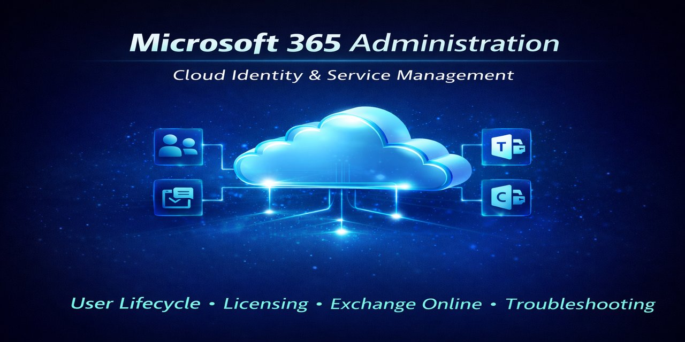
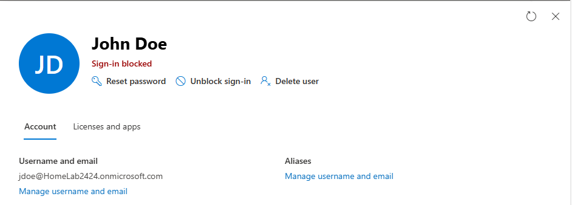
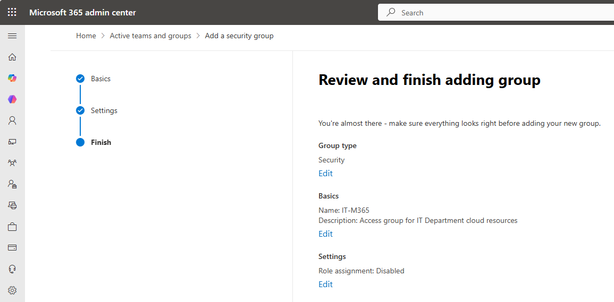
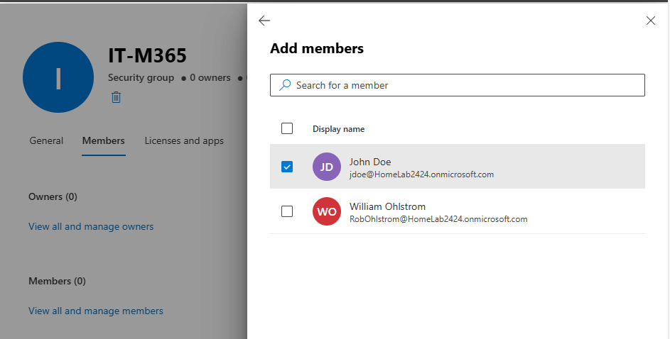
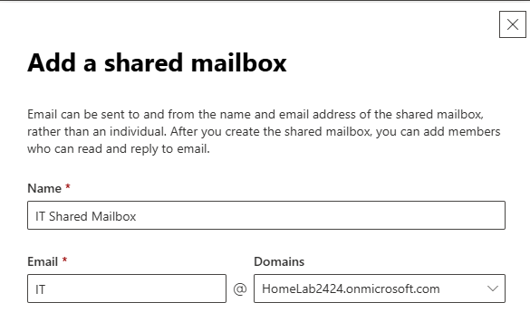

## Operational Relevance

This project demonstrates foundational Microsoft 365 (M365) skills modeled after an IT Support environment. Proficiency with Tier-1 IT support tasks is demonstrated with screenshots (click the > dropdowns to view). Troubleshooting activities are supplemented with ITSM-style tickets which are documented in a companion repository.    

(see: [Troubleshooting Journal](https://github.com/robohlstrom24/troubleshooting-journal))

## Tier-1 Job Duties

  
 Employee Onboarding ( Create User, Assign License, Validate Mailbox ) 

  
  ____________________________

  
  _______________________________

  
  ________________________________

  
  

  
 Password Reset & Sign-in Block 

  
  _________________________________

  
  _________________________________

  
  

 
  
Access Provisioning Through Groups (RBAC) 

  
  _________________________________________

  
  

  
Create Shared Mailbox and Assign Access 

  
  ________________________________________

  

## Tier-2 Job Duties

  
Troubleshooting Email Malfunction AFter Licensing Group Removal

## Scenario: A user's licensing group is inadvertantly removed during department/role change, offboarding/reboarding error, or automation error with a bulk group cleanup script

__________________________________________

_________________________________________________

___________________________________________________

_________________________________________________

__________________________________________________

