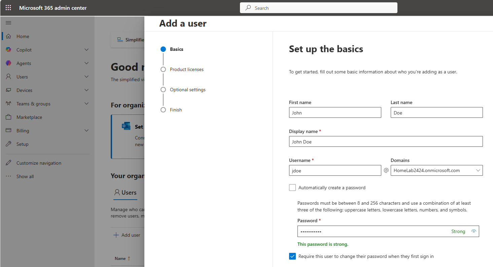
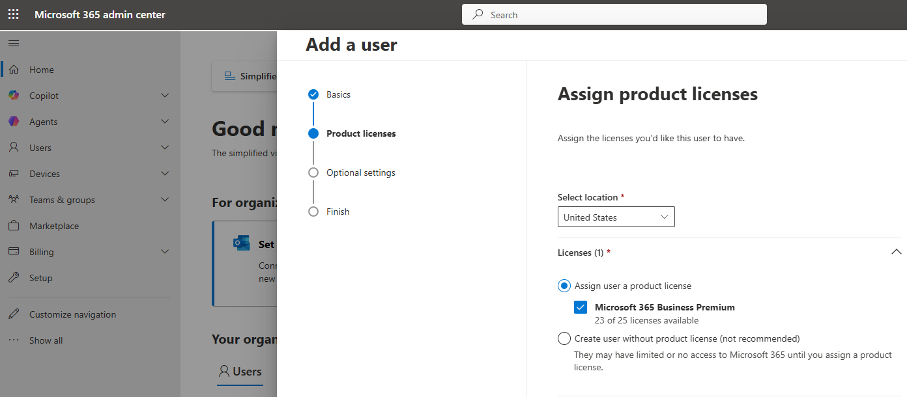
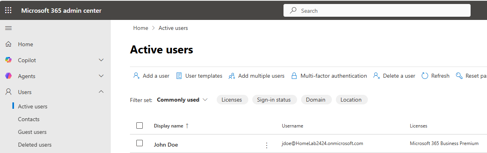
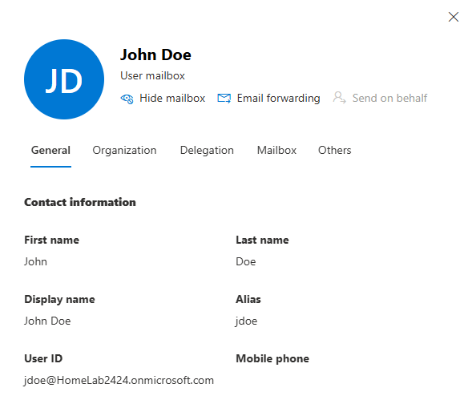
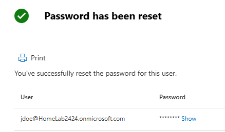
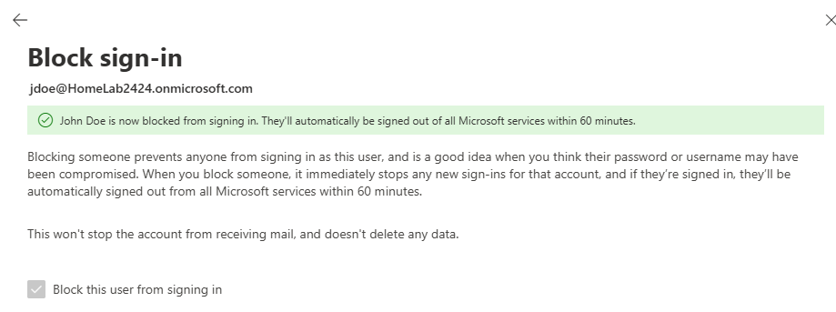

# Microsoft 365 Lab

(project in progress)

## Operational Relevance

This project demonstrates foundational Microsoft 365 (M365) skills modeled after an IT Support environment. Proficiency with tier 1 IT support tasks is demonstrated with screenshots (click the > dropdowns to view). 

  
 Employee Onboarding ( Create User, Assign License, Validate Mailbox ) 

  
  ____________________________

  
  _______________________________

  
  ________________________________

  
  

  
 Password Reset & Sign-in Block 

  
  _________________________________

  
  _________________________________

  
  

